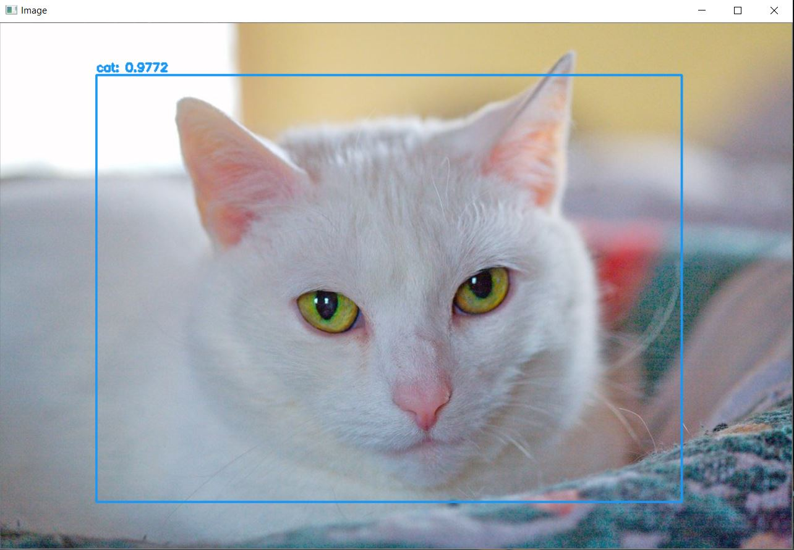
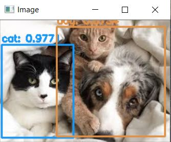
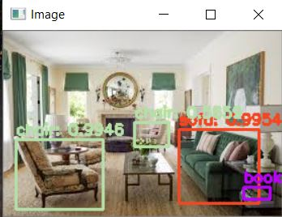
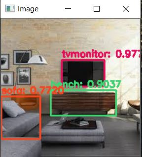

# YOLO-Object-Detection-using-open-CV

## Implementation of object detection in images using yolo model and open-cv.

Content in repo :

#### yolo-coco folder contains:
1. yolov3.cfg (configuration file)
2. coco.names (list of classes)
3. yolov3.weights (pre-trained weight file) available at: 
https://pjreddie.com/darknet/yolo/

#### images folder :
Images for testing the model

#### yolo.py 


To run the model on one of the images in images folder after entering the directory :

```bash 
python yolo.py --image images/cat.jpg --yolo yolo-coco
```

Output Images :
<p align="center">
  

  
  
  
  
  
    
</p>
